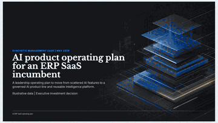
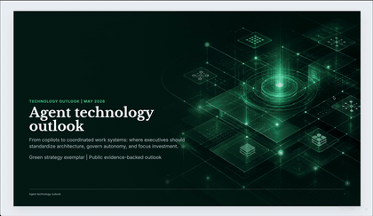
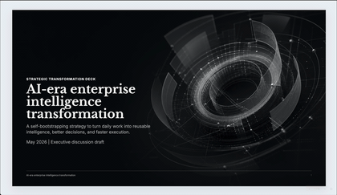
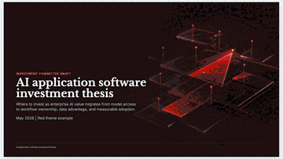

# MBB Page Maker

MBB Page Maker gives coding agents a ready-to-use system for producing consulting-style HTML PPT decks: strategy pages, board updates, investment memos, and executive narratives.

Install it once, then use it from Codex, Claude Code, Cursor, OpenClaw, Hermes, or any agent that can read a local skill package. Decks stay static, inspectable, and exportable to self-contained HTML, PDF, and PNG.

> Design constraints:
>
> - One-command install.
> - No build step.
> - Pure static HTML/CSS/JS.
> - Default exports to self-contained HTML package, PDF, and PNG.

[中文 README](README.zh-CN.md)

## Example Gallery

<p align="center">
  <a href="https://nomici.ai/mbb-page-maker/examples/ai-erp-saas-lop/index.html"></a>
  <a href="https://nomici.ai/mbb-page-maker/examples/agent-technology-outlook/index.html"></a>
</p>
<p align="center">
  <a href="https://nomici.ai/mbb-page-maker/examples/ai-erp-saas-lop/index.html">ERP SaaS LOP</a> ·
  <a href="https://nomici.ai/mbb-page-maker/examples/agent-technology-outlook/index.html">Agent Technology Outlook</a>
</p>
<p align="center">
  <a href="https://nomici.ai/mbb-page-maker/examples/enterprise-intelligence-transformation/index.html"></a>
  <a href="https://nomici.ai/mbb-page-maker/examples/ai-application-investment-thesis/index.html"></a>
</p>
<p align="center">
  <a href="https://nomici.ai/mbb-page-maker/examples/enterprise-intelligence-transformation/index.html">Enterprise Intelligence Transformation</a> ·
  <a href="https://nomici.ai/mbb-page-maker/examples/ai-application-investment-thesis/index.html">AI Application Investment Thesis</a>
</p>

Quick links: [Full-Deck Index](https://nomici.ai/mbb-page-maker/templates/full-decks/index.html)

> Tell your agent what to do:
>
> ```bash
> npx skills add https://github.com/NomiciAI/mbb-page-maker
> ```
>
> Then prompt Codex, Claude Code, Cursor, OpenClaw, Hermes, or any compatible coding agent with: `Use mbb-page-maker to create...`

## Install

Install the skill package from GitHub:

```bash
npx skills add https://github.com/NomiciAI/mbb-page-maker
```

For broad agent discovery, install it into all detected clients:

```bash
npx skills add https://github.com/NomiciAI/mbb-page-maker --agent '*'
```

This is the recommended path when you use more than one coding agent, such as Codex, Claude Code, Cursor, OpenClaw, Hermes, or similar clients.

If a client reports `Unknown skill` while `.agents/skills/mbb-page-maker/` exists, the package is installed but not linked into that client's skill directory. Run:

```bash
.agents/skills/mbb-page-maker/scripts/link-agent-adapters.sh .
```

See `references/agent-compatibility.md` for project/global paths and client-specific troubleshooting.

## Use With An Agent

After installation, ask your coding agent to use `mbb-page-maker` by name and describe the audience, decision, source material, and desired output.

```text
Use mbb-page-maker to create a 10-slide board update from the notes below.
Audience: CEO and direct reports.
Goal: align on the next two-quarter AI product investment plan.
Use the blue executive theme. Produce the HTML deck, then render the package, PDF, and PNG slides.
```

```text
Use mbb-page-maker to turn this investment memo into an IC-ready deck.
Make the storyline recommendation-led, include market structure, underwriting logic, risks, and decision asks.
Use a red investment style. Keep the deck concise and executive-facing.
```

```text
Use mbb-page-maker to improve this existing deck.
Tighten the storyline, replace weak pages with stronger consulting-style layouts, check for overflow,
and render a self-contained HTML package when done.
```

Good prompts usually include:

- Audience and decision context.
- Source material or data.
- Target page count or time limit.
- Theme preference, if any.
- Required outputs: HTML only, or HTML package plus PDF and PNG.

## Manual Quick Start

```bash
# Get the repo
git clone https://github.com/NomiciAI/mbb-page-maker.git
cd mbb-page-maker

# Browse public demo decks
open examples/ai-erp-saas-lop/index.html
open examples/agent-technology-outlook/index.html
open examples/enterprise-intelligence-transformation/index.html
open examples/ai-application-investment-thesis/index.html

# Browse the full-deck template index
open templates/full-decks/index.html

# Scaffold a new deck from the starter template
./scripts/new-deck.sh my-talk
open my-talk/index.html

# Export a self-contained HTML package, PDF, and PNG slide images
./scripts/render.sh my-talk/index.html
open my-talk/dist/package/index.html
```

## Design System

MBB Page Maker is built around a simple constraint: the source deck should stay readable, editable, and portable. A generated deck is just HTML, CSS, JavaScript, and local assets. There is no framework runtime, no build step, and no CDN dependency in the final package.

The design system separates structure from styling:

- `base.css`: slide canvas, typography, runtime controls, and print rules.
- `layouts.css`: page-level layout shells.
- `components.css`: reusable tables, cards, metrics, roadmaps, matrices, and profile blocks.
- `illustrations.css`: neutral visual primitives and asset slots.
- `themes/*.css`: color tokens for blue, green, red, pitch, mono, and classic themes.
- `assets/media/`: optional static images, covers, screenshots, and showcase assets.

The intended workflow is compositional. The agent starts from a simple deck shell, chooses the message structure, picks layouts and components, applies a theme, then render-checks the result. Templates are references, not rigid slide masters: `templates/full-decks/` teaches storyline pacing, `templates/showcase/` shows page-level patterns, and `examples/` shows public finished demos.

Export is deliberately boring. `scripts/render.sh` creates a self-contained HTML package, PDF, and PNG slide images. Final packages inline local CSS, JavaScript, fonts, and media so `package/index.html` can be opened directly in a browser.

## Project Structure

```text
mbb-page-maker/
├── SKILL.md
├── README.md
├── README.zh-CN.md
├── references/
│   ├── authoring-guide.md
│   ├── agent-compatibility.md
│   ├── consulting-thinking.md
│   ├── adding-patterns.md
│   ├── pattern-index.md
│   ├── components.md
│   ├── layouts.md
│   ├── themes.md
│   ├── full-decks.md
│   ├── visual-assets.md
│   └── asset-sourcing.md
├── assets/
│   ├── css/
│   │   ├── base.css
│   │   ├── components.css
│   │   ├── illustrations.css
│   │   ├── layouts.css
│   │   └── fonts.css
│   ├── js/
│   │   └── runtime.js
│   ├── fonts/
│   │   └── google/
│   ├── media/
│   │   ├── covers/
│   │   └── headshots/
│   └── themes/
│       ├── blue.css
│       ├── green.css
│       ├── red.css
│       ├── pitch.css
│       ├── mono.css
│       └── classic.css
├── templates/
│   ├── starter-deck.html
│   ├── deck.html
│   ├── neutral-skeleton.html
│   ├── light-skeleton.html
│   ├── dark-skeleton.html
│   ├── mixed-skeleton.html
│   ├── full-decks/
│   ├── showcase/
│   ├── components/
│   └── layouts/
├── scripts/
│   ├── new-deck.sh
│   ├── check-deck-quality.sh
│   ├── check-deck-contrast.sh
│   ├── fetch-fonts.sh
│   ├── split-component-css.sh
│   ├── link-agent-adapters.sh
│   └── render.sh
└── examples/
    ├── ai-erp-saas-lop/
    ├── agent-technology-outlook/
    ├── enterprise-intelligence-transformation/
    └── ai-application-investment-thesis/
```

## Contributing

Contributions are welcome through pull requests.

See `CONTRIBUTING.md` for PR expectations, testing notes, and repository hygiene.

## Acknowledgements

Inspired by [lewislulu/html-ppt-skill](https://github.com/lewislulu/html-ppt-skill). This project is written from scratch with its own structure, templates, runtime, and design system.

## License & Author

Apache-2.0. Copyright 2026 Saitop <<saitop@nomici.ai>>.
